# 🔐 Secrets Management with Vault & WordPress Setup using Packer and Vagrant

This project demonstrates how to use **HashiCorp Vault** for secrets management by setting up two virtual machines using **Packer** and **Vagrant** on a Mac M1.

---

## 📦 Project Overview

The setup involves:

- Creating two Ubuntu 22.04 virtual machines using Packer:
  - **VM1**: Vault server setup
  - **VM2**: WordPress server pulling secrets from Vault

---

## 🧱 Technologies Used

- HashiCorp **Packer**
- **Vagrant**
- **Vault**
- **Ubuntu 22.04**
- **WordPress**
- Shell scripts and provisioning
- Mac M1 terminal setup

---

## 📂 Step-by-Step Project Documentation

---

### part-1 

This part sets up the first virtual machine which runs the Vault server.

-->  cd into the directory `ubuntu_22043_m1_mac`.  
-->  Build the VM image using the following commands:  
```bash
packer init .
packer validate .
packer build .
```
-->  Once the box is built, add it to Vagrant using `vagrant box add` inside the `vault-server` directory.

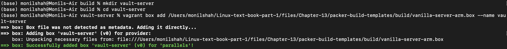

-->  In that directory, run `vagrant init vault-server` to generate a Vagrantfile.  
-->  Edit the file: uncomment line 35 to add a host-only adapter and set a static IP `192.168.56.99`.  
-->  Run the following to start the VM and SSH into it:
```bash
vagrant up
vagrant ssh
```
-->  Inside the VM, rename the hostname:
```bash
sudo hostnamectl set-hostname MS-vault-server
exit
vagrant ssh
```

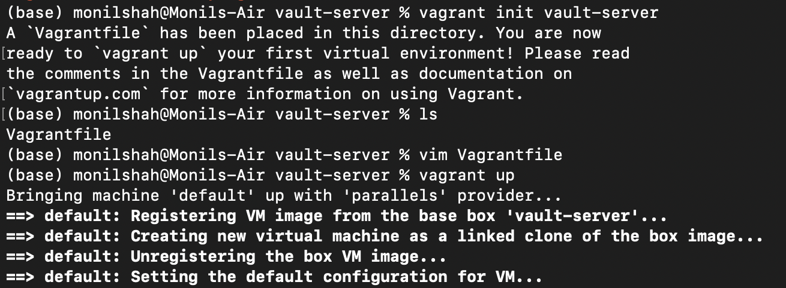

-->  Install HashiCorp Vault using official instructions.

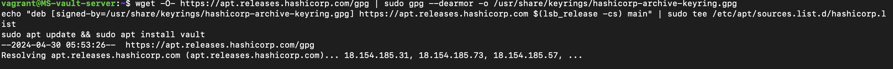

-->  Edit `~/.bashrc` to add Vault environment variables and then source it:
```bash
# Tells Vault to listen for connections on Local Host
export VAULT_ADDR='https://127.0.0.1:8200'
# Tells vault to skip third part verification of TLS cert
# Accept the self-signed TLS cert
export VAULT_SKIP_VERIFY="true"
source ~/.bashrc
```

-->  Start Vault:
```bash
sudo systemctl start vault
```


-->  Initialize Vault and unseal it:
```bash
vault operator init
vault operator unseal   # Run this 3 times with 3 different unseal keys
vault login             # Use root token
```

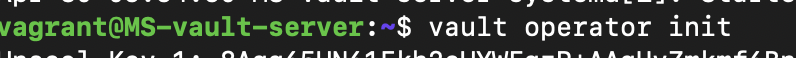

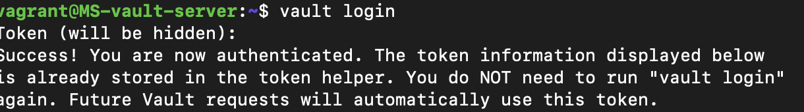

-->  Enable KV v2 secrets engine:
```bash
vault secrets enable -version=2 -path=secret kv
```

-->  Create a policy file `ssh-secrets.hcl`:
```hcl
path "secret/data/*" {
  capabilities = ["read","create", "update","delete"]
}
```

-->  Upload the policy:
```bash
vault policy write ssh-secret-policy ./ssh-secrets.hcl
```

-->  Create a token for that policy:
```bash
vault token create -ttl=21600m -policy=ssh-secret-policy
```

-->  Store secrets:
```bash
vault kv put -mount=secret team00-db DBPASS=password DBUSER=wp-user DATABASENAME=wp
vault kv put -mount=secret team00-ssh SSHPASS=vagrant
```

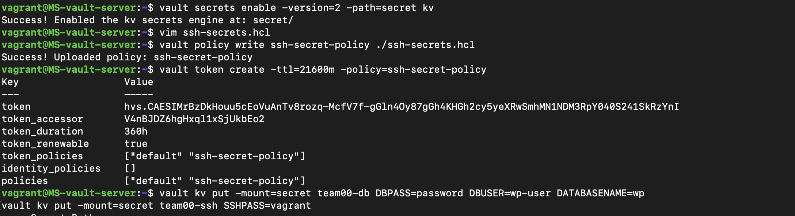

-->  On Mac terminal, edit `~/.zprofile` to add:
```bash
# The 192.168.56.99 is the value we set on line 35 of the 
# Vault-Server Vagrantfile
export VAULT_ADDR='https://192.168.56.99:8200'
export VAULT_SKIP_VERIFY="true"
export VAULT_TOKEN="hvs.CAESIKEylPWlNpOTN.............................ZTRnMxY2"
source ~/.zprofile
```

✅ **part-1 complete**

---

### part-2 

This part sets up the WordPress virtual machine that connects to Vault for secrets.

-->  cd into the `ubuntu_22043_m1_mac-vault-example` folder  
-->  Open `pkr.hcl` and do the following:
- Add the chapter 12 WordPress install shell script in the `provisioner` block
- Set up the necessary environment variables  

-->  Run the following Packer commands:
```bash
packer init .
packer validate .
packer build .
```

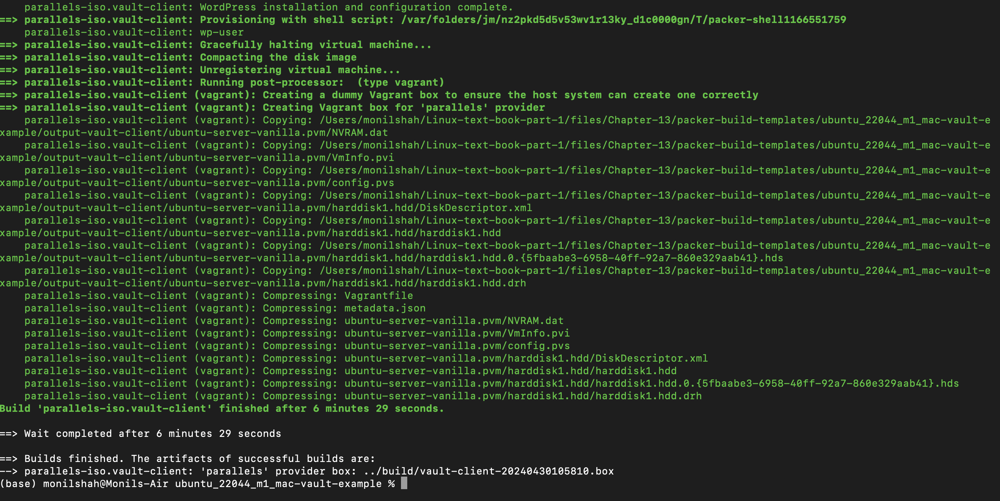

-->  Add the new box to Vagrant  
-->  Run `vagrant init wordpress-server` to generate the file  
-->  Edit and uncomment line 35 to assign static IP `192.168.56.100`  
-->  Boot the VM:
```bash
vagrant up
```

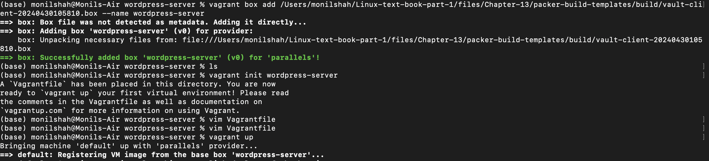

---

### part-3 

Access WordPress and confirm everything works.

-->  Open a browser and go to:  
```
http://192.168.56.100/wordpress
```

-->  Complete the WordPress setup and create a blog post.

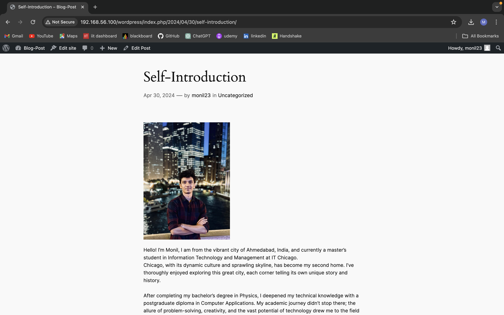  
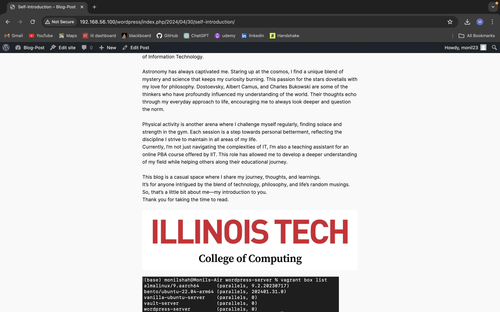  
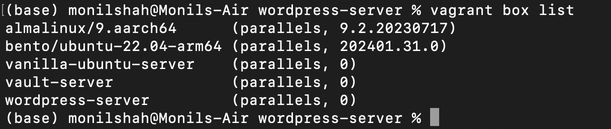

✅ **Project Complete**

---

## 🚀 Outcome

Successfully demonstrated secure secrets management using Vault with an automated WordPress deployment on two virtual machines using Packer and Vagrant.
